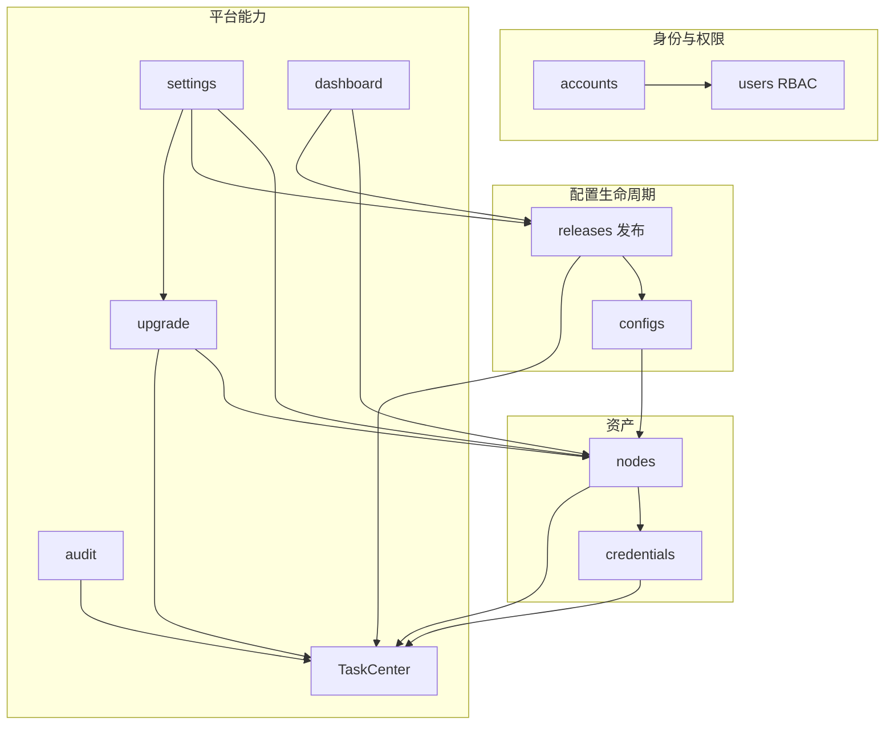

# 00 · 产品概述与术语

## 1. 产品定位

**mngxops（MngxOps）** 是面向运维人员的 **Nginx 多节点配置运维平台**：统一管理节点与 SSH 凭证，发现/编辑节点上的 Nginx 配置，按绑定版本发布与回滚，支持源码编译升级 Nginx，并提供任务中心、审计与系统参数配置。

技术形态：Django 4.2 服务端渲染（Bootstrap 5）+ 部分 JSON API；远程操作用 Paramiko SSH；异步任务为进程内线程 + `TaskCenterTask` 统一可见性（无 Celery）。

## 2. 范围与边界

### 2.1 范围内

- 节点库存、软删除与同 IP 恢复、Excel 批量导入
- SSH 凭证加密存储与启用联调测试
- 配置标签、节点绑定、绑定级版本、远程发现同步
- 发布中心（节点×绑定勾选）、发布/回滚执行、发布历史
- 统一任务中心与全屏进度遮罩轮询
- Nginx 源码包管理与多节点编译升级向导
- RBAC（用户 / 角色 / 用户组）、操作审计、登录日志
- 系统设置（已接线 PRESET）与数据保留清理

### 2.2 范围外（当前未实现或不在产品目标内）

- 独立消息队列 / 多进程 Worker 集群调度
- 配置漂移自动检测闭环（字段与枚举预留，见 Q86）
- 对非 Nginx 中间件的通用配置管理
- 移动端专属 App

## 3. 角色

| 角色 | 说明 |
|------|------|
| 匿名用户 | 仅可访问登录页 |
| 普通运维 | 由角色/直授/用户组角色授予 `resource.action` 权限后访问对应模块 |
| 超级用户 | `is_superuser` 绕过全部自定义权限检查 |
| 系统 | 启动 seed 设置、按日数据保留清理（中间件 + management command） |

权限资源：`nodes` / `credentials` / `configs` / `releases` / `upgrade` / `users` / `roles` / `teams` / `audit` / `settings`，动作：`read` / `create` / `update` / `delete`。详见 [04-users-rbac.md](04-users-rbac.md)。

## 4. 术语表

| 术语 | 代码实体 / 路径 | 含义 |
|------|-----------------|------|
| 配置标签 | `Config` | 配置「类型」元数据（名称、默认路径、模板），不含节点侧实际内容 |
| 绑定 | `ConfigNodeBinding` | 某配置标签在某节点上的实例：路径、内容、版本、同步状态 |
| 绑定版本 | `BindingVersion` | 绑定内容的版本快照 |
| 同步 | configs sync | 从远程发现/拉取配置并写入绑定（非发布推送） |
| 发布 | release publish | 将绑定某版本内容推送到远程并校验/reload |
| 发布任务 | `ReleaseTask` | 单条「绑定+版本→节点」的发布/回滚记录 |
| 批次号 | `batch_number` | 发布：`release-YYMMDD-XXXX`；升级：`UG-YYMMDD-XXXX` |
| 发布中心 | `/releases/center/` | 勾选节点与绑定并触发发布的工作台 |
| 发布历史 | `/releases/list/` | 按批次分组的发布/回滚历史与勾选回滚 |
| 任务中心 | `/releases/history/` | 全平台异步任务列表与详情（易与发布历史混淆，务必区分） |
| 任务中心任务 | `TaskCenterTask` | 异步作业统一模型 |
| 角色 | `UserGroup` | 权限集合；路由别名 `/users/roles/` |
| 用户组 | `UserTeam` | 人员分组，可关联角色 |
| 节点组 | `NodeGroup` | 主机分组标签 |
| 凭证 | `Credential` | SSH 密码或私钥（Fernet 加密落库） |

## 5. 模块地图

## 6. 核心业务主线

1. 录入凭证 → 录入/导入节点并绑定凭证 → SSH 探测在线。
2. 配置同步向导发现远程文件，或手动创建配置标签并绑定节点。
3. 编辑绑定内容产生新版本（`modified`）→ 发布中心勾选推送 → 成功后 `synced`。
4. 失败或变更后可通过发布历史单条/勾选回滚。
5. 需要换版本 Nginx 时走升级中心：选节点与源码包 → 调整模块参数 → 远程编译安装 reload。

## 7. 仓库与文档入口

| 路径 | 说明 |
|------|------|
| `apps/*` | 业务 Django 应用 |
| `utils/` | SSH、nginx 启停、设置读取、加密、分页、数据保留 |
| `templates/base.html` | 全局壳：侧栏、权限菜单、`#asyncProgressOverlay` |
| `AGENTS.md` | 优化点结论台账 Q1–Q119+（唯一来源） |
| `docs/` | 本需求设计文档集 |
