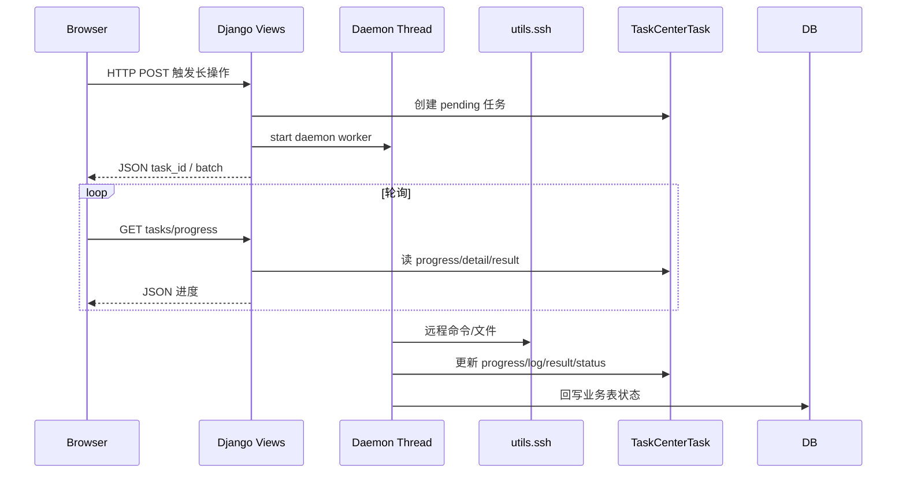

# 01 · 系统架构

## 1. 技术栈

| 层级 | 选型 | 说明 |
|------|------|------|
| 语言 / 运行时 | Python 3.9.6 | 项目开发约定 |
| Web 框架 | Django 4.2.30 | `requirements.txt` |
| DB | 默认 SQLite（`db.sqlite3`） | `ngxops/settings.py` |
| SSH | Paramiko 5.x | `utils/ssh.py` |
| 加解密 | cryptography Fernet | `utils/crypto.py`，密钥文件 `utils/.fernet_key` |
| Session 签名 | Django `SECRET_KEY` | 环境变量或数据目录 `.secret_key`（Q161） |
| Excel | openpyxl | 节点批量导入 |
| 前端 | Bootstrap 5 + 服务端模板 + 少量 JS | 无独立 SPA |

项目包：`ngxops/`；业务应用：`apps/`；共享工具：`utils/`。

## 2. 进程与请求模型

- **无 Celery/RQ**：长任务用 `threading.Thread(daemon=True)` 或 `ThreadPoolExecutor`。
- **多 Worker 部署注意**：内存中的发布实时步骤缓存（如 `_RELEASE_CURRENT_STEPS`）仅本进程有效；进度以 DB 中 `TaskCenterTask` 为准。
- **Web 启动清理**：加载 WSGI 时将遗留 `pending`/`running` 标失败（Q161），`migrate` 不执行。

## 3. URL 挂载

入口：[`ngxops/urls.py`](../ngxops/urls.py)

| 前缀 | 应用 |
|------|------|
| `/` | dashboard + accounts |
| `/users/` | users |
| `/credentials/` | credentials |
| `/nodes/` | nodes |
| `/configs/` | configs |
| `/releases/` | releases（含发布中心、任务中心、发布历史） |
| `/upgrade/` | upgrade |
| `/audit/` | audit |
| `/settings/` | settings |
| `/admin/` | Django Admin |

`LOGIN_URL` → `accounts:login`；登录成功 → `dashboard:index`。

## 4. 认证与权限横切

- Session 认证；业务 View 普遍 `LoginRequiredMixin` + `PermissionRequiredMixin`（[`apps/users/permissions.py`](../apps/users/permissions.py)）。
- AJAX：`AjaxErrorMiddleware`（[`apps/audit/middleware.py`](../apps/audit/middleware.py)）对未登录/无权限返回 JSON。
- 模板：`` 控制侧栏与按钮。

权限解析顺序：超级用户 → `UserProfile.direct_permissions` → 个人角色（`profile.groups`）→ 否则用户组关联角色。

## 5. SSH 与 Nginx 操作层

### 5.1 `utils/ssh.py`

职责概要：连接/测试、远程读写与备份、配置发现（`discover_nginx_configs`）、系统信息采集、Nginx 版本探测等。连接超时等取自 `get_setting("node.ssh_connect_timeout")` 等。

### 5.2 `utils/nginx_ops.py`

检测进程启动方式（systemctl / 直接二进制），执行 reload/restart/start/stop；发布、升级与启停页共用。

### 5.3 凭证解密

业务层通过 `Credential.get_password()` / `get_private_key()` 解密后交 SSH；密钥不以明文进审计详情。

## 6. TaskCenter 统一异步模型

模型：[`TaskCenterTask`](../apps/releases/models.py)。

| 字段 | 用途 |
|------|------|
| `operation_type` | 任务类型枚举 |
| `status` | pending/running/success/failed/cancelled |
| `progress` | 0–100 |
| `detail` | 当前说明 |
| `result` | 结束后的结果树文本（协议见 [09-task-center.md](09-task-center.md)） |
| `log_output` | 增量执行日志 |
| `source_batch` | 关联发布/升级/安装/启停批次号 |
| `target_*` | 主机名/IP/配置摘要 |
| `trigger_user` | 触发人 |

进度 API：`GET /releases/tasks/progress/` → `TaskCenterProgressAPIView`。  
全局 UI：[`templates/base.html`](../templates/base.html) `#asyncProgressOverlay`，轮询间隔 `system.task_progress_poll_interval`（经 context processor 注入 `sys_poll_interval_ms`）。

跨模块回写关联示例：

- `ConfigNodeBinding.last_sync_task_id`
- `CredentialEnableTask.task_center_id`
- `NginxUpgradeTask.task_center` FK

## 7. 系统设置与缓存

- 存储：`SystemSetting` + 启动 `seed_default_settings()`（不覆盖已有用户值）。
- 读取：`utils/setting_service.get_setting(key, default)`，Django cache 约 1 小时 TTL；保存后 `refresh_setting_cache`。
- 仅 [`PRESET_SETTINGS`](../apps/settings/models.py) 中条目为已接线配置（见 [12-settings.md](12-settings.md)）。

## 8. 数据保留

- `DataRetentionMiddleware` 触发按日清理；亦可 `manage.py purge_expired_data`。
- 清理对象：任务中心、发布任务、操作日志、登录日志（天数见系统设置）。
- **跳过** `pending` / `running` 中的任务，避免误删在途作业。

## 9. 审计横切

- `CurrentUserMiddleware`：线程本地当前用户，供信号取操作人。
- `post_save` / `post_delete` 对 `TRACKED_MODELS` 写 `AuditLog`（结果多为 success，见 Q94）。
- TaskCenter 创建钩子写入带 `task_center_id` / `source_batch` 的审计（Q70）。

## 10. 静态与上传

- `MEDIA`：源码包 `nginx_packages/`、用户头像 `avatar/` 等。
- 源码 `DEBUG=True`：`manage.py runserver` 托管 `/static/` 与 `/media/`。
- 二进制默认 `DEBUG=False`：Waitress 无 StaticFilesHandler；由 `urls.py` 用 staticfiles finder（`insecure=True`）托管 `/static/`，并用 `django.views.static.serve` 托管 `/media/`。首次启动不必 `collectstatic` 即可访问站点图标等打包资源。

## 11. 架构约束（实现即需求）

1. 发布同节点复用 SSH，同节点批次统一 reload 一次（Q80）；未运行则 start（Q147）。
2. 进度展示以 TaskCenter 真实进度为准，禁止假倒计时（Q39）。
3. 设置项须「所见即所得」：仅保留已接线 PRESET（Q75）。
4. UI 遵循全局 data-table / btn-sm / showConfirm 等规范（Q41/Q42/Q66）。
