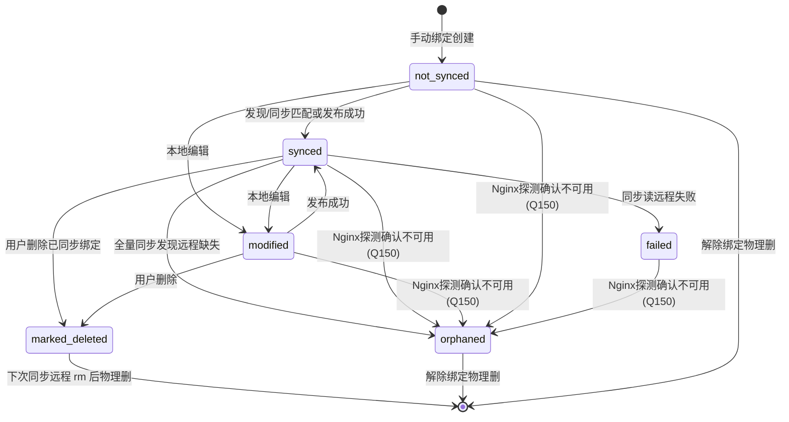

# 07 · 配置管理（configs）

## 1. 模块目标与范围

管理**配置标签**与**节点绑定**、绑定级版本历史、差异对比、远程发现/同步向导、解除绑定策略。

**不做**：完整配置漂移检测闭环（字段预留，Q86）；未绑定标签批量操作（Q5 关闭）。

## 2. 角色与权限

`configs.read|create|update|delete`。

## 3. 领域模型

[`apps/configs/models.py`](../apps/configs/models.py)

### Config（配置标签）

`name`、`default_remote_path`、`template_content`、`source`(manual/discovered)、`description`、审计字段。

### ConfigNodeBinding

| 字段 | 说明 |
|------|------|
| `config`+`node` | unique_together |
| `remote_path` | 节点绝对路径 |
| `content` | 当前内容 |
| `current_version` / `synced_version` | 版本指针 |
| `sync_status` | 见状态机 |
| `last_sync_*` / `last_sync_task_id` | 同步结果与任务跳转（Q8） |
| `remote_content_hash` / `drift_detected_at` | 漂移预留 |
| `source` | manual/discovered |

### BindingVersion

每绑定独立版本；`version`+`content`+`remark`。

### ConfigSyncSetting

节点 `main_conf_path`。

## 4. 同步状态机

### 4.1 枚举（模型 choices）

`not_synced` | `synced` | `modified` | `conflict` | `orphaned` | `syncing` | `failed` | `marked_deleted`

### 4.2 实际写入路径（已确认行为）

| 状态 | UI | 代码写入 |
|------|-----|----------|
| conflict | **主推过滤已下线**（Q84）；行内兜底 badge 仍可显示脏数据 | **无**（未启用） |
| syncing | **主推过滤已下线**（Q85） | **无**（未启用） |
| orphaned | 「远程已删除」 | 全量同步路径缺失；**或** Nginx 探测 `nginx_available=false` / 发现为空时 `mark_node_bindings_orphaned`（Q150）。**勿与** `marked_deleted` 混用 |

漂移字段 `remote_content_hash` / `drift_detected_at` 与 `config_drift_check`：**现阶段不做**（Q86 关闭）；hash 仍可在发布成功时写入。

**无 Nginx 节点门禁（Q150）**：`nginx_available is not True` 时禁止同步/新建编辑绑定/版本恢复待推送；允许查看与解除绑定（无 Nginx 时一律物理删，不发起远程 rm）。

## 5. 页面与路由

主列表：`/configs/` 节点可展开 + 未绑定标签区（Q1/Q4）。  
绑定创建弹窗多选节点（Q3）。  
版本：仅 `/configs/bindings/<pk>/versions/…` 与 compare/apply（Q95）。  
同步向导：`/configs/sync/`。

## 6. 用例

### 6.1 创建配置标签

- 手动添加后跳转绑定创建，config 预选（Q2）。  
- 若带 `node_id`：自动创建绑定并回列表（Q11）。

### 6.2 创建绑定

- 弹窗：主机名/IP/组搜索、行点击勾选（Q3/Q4）。  
- 循环创建多绑定；初始 `not_synced`，写 v1 `BindingVersion`。  
- 内容可来自模板或空。

### 6.3 编辑绑定

- 编辑 → 审阅差异 → 新版本；`sync_status=modified`。

### 6.4 版本历史

- 列表/详情/对比/恢复。  
- 恢复后一律 `sync_status=modified`，需再发布才与远程一致（Q91）。

### 6.5 解除绑定

- `not_synced`/`orphaned`：**物理删除**（Q7）。  
- 其他：标 `marked_deleted`（文案「已标记删除」），下次同步清理远程文件（Q103）。

### 6.6 同步向导

1. 选节点（勾选/并发上限 `node.batch_max_count`），指定/默认主配置路径。  
2. `ConfigSyncBatchAPIView` / `Single`：线程池 SSH `discover_nginx_configs`（深度 `config.discover_max_depth`）。  
3. `apps/configs/services.py`：`sync_discovered_configs` 创建/更新 Config 与 Binding、版本；**跳过** `marked_deleted` 绑定（避免 unique 冲突再导入），结束后 `_cleanup_marked_deleted_bindings` 远程 rm + 物理删并返回已删名单；无发现结果时亦执行清理（Q103）。  
4. 全量同步可标记 orphaned；写 `last_sync_task_id` → TaskCenter `config_batch_sync`。  
5. 进度：TaskCenter 轮询（Q9/Q39）；遮罩展示精简阶段 `hostname · 阶段` 与实时结果树（Q104）；完成摘要 `detail` 为「N 新增, M 更新, D 删除」，**最终结果树**含新建/更新/删除/**跳过**项（Q105）；任务详情对 `config_batch_sync` 默认展开结果树；失败标黄跳配置列表主机名过滤；状态链任务详情（Q8）；同步线程异常时任务标 `failed`，避免遮罩卡住（Q103）。

### 6.7 Glob 预览

`ConfigGlobPreviewView`：仅支持**单个**节点；多 `node_ids` 返回 400（Q92）。同步 HTTP，不建 TaskCenter。

## 7. 实现要点

| 能力 | 路径 |
|------|------|
| 发现/同步 | `apps/configs/services.py` |
| View/API | `apps/configs/views.py` |
| SSH 发现 | `utils/ssh.discover_nginx_configs` |
| 过滤器 | `templatetags/config_filters.py` |

## 8. 前后端约定

- 返回列表恢复节点展开（Q1）。  
- 节点展示对齐发布中心，无快速推送（Q32）。  
- 对比页返回必须用 `binding_versions`（Q44）。  
- 删除模板备注占位已移除（Q6）。

## 9. 异常与边界

- 远程文件消失 → orphaned。  
- 读失败 → failed + last_sync_error。  
- 唯一约束 (config, node) 防止重复绑定。

## 10. 关联模块

nodes、releases（发布消费绑定版本）、task center、dashboard、settings、audit。

## 11. 已落地优化索引

Q1–Q11、Q32、Q44 及同步相关 Q8/Q9/Q39 等（见 AGENTS）。

## 12. 待确认缺口

相关项已按建议落地或关闭，见 [`AGENTS.md`](../AGENTS.md)（Q84–Q95）。版本历史仅走 bindings 路由；`ConfigVersion` 与双路由已清理（Q95）。
