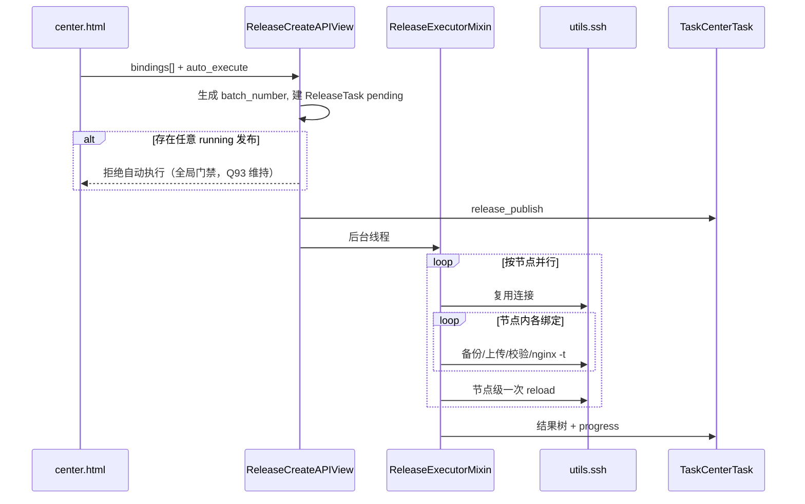

# 08 · 发布中心与发布历史（releases）

## 1. 模块目标与范围

将绑定指定版本推送到远程 Nginx 节点；支持发布中心勾选发布、发布历史查询、单条/勾选回滚、失败重试。任务中心同属 `apps.releases`，详见 [09-task-center.md](09-task-center.md)。

**不做**：灰度流量切换、金丝雀（应用层）；传统独立 create 表单页已删除（Q27）。

## 2. 角色与权限

`releases.read|create|update|delete`（delete 使用场景较少）。  
发布/回滚执行通常要求 create/update。

## 3. 领域模型

[`apps/releases/models.py`](../apps/releases/models.py)

### ReleaseTask

| 字段 | 说明 |
|------|------|
| `batch_number` | `release-YYMMDD-XXXX` |
| `binding` / `config` / `node` | 目标 |
| `version` FK / `publish_version` | 发布版本 |
| `remote_path` | 冗余路径 |
| `status` | pending/running/success/failed/**rollback**/cancelled |
| `result` | 执行结果文本 |
| 时间戳 | started/finished/created |

注意：`status=rollback` 在 choices 中存在，但回滚会**新建**任务，源任务通常不改写为 rollback（Q89 已关闭：维持该模型）。

### ReleaseHistory

`action`=publish|rollback；关联 `release_task`。

内容读取：`ReleaseTask.content_to_publish` 优先按 binding+publish_version 取 `BindingVersion`。

## 4. 页面与路由

| 功能 | 路径 |
|------|------|
| 发布中心 | `/releases/center/` |
| 创建发布 | `POST /releases/api/create/` JSON |
| 节点/绑定 API | `api/nodes/`、`api/node-bindings/<id>/` |
| 发布历史 | `/releases/list/` |
| 详情/回滚/重试 | `/releases/<pk>/`、`rollback/`、`retry/` |
| 勾选回滚 | `api/selected-rollback/` |
| 版本预览 | `version/<id>/content/` |

模板：`center.html`、`list.html`、`detail.html`、`rollback.html`。

## 5. 发布中心流程

### 5.1 选择交互（已确认）

- 两步：选节点 → 展开/加载绑定；勾选节点可联动勾选绑定（Q14）。  
- 状态过滤栏 + `status_counts`（Q20）；搜索配置名/路径（Q25/Q47）。  
- 行点击展开/勾选；路径 Modal 预览；版本下拉预览对应当前选项（Q17/Q19）。  
- 确认清单 Accordion；三级发布：全量 / 本节点 / 单配置（Q21/Q23）。  
- 刷新后展开态恢复；有缓存则不重复「加载绑定…」（Q31/Q46）。

### 5.2 执行管线（Q80）

实现：`ReleaseExecutorMixin`（[`apps/releases/views.py`](../apps/releases/views.py)）。

对**同一节点**一次 SSH 会话内：

1. **备份**：`{release.backup_dir}/{hostname}/filename.timestamp`；远程不存在则跳过（Q48/Q61）。  
2. **上传**：SFTP 至临时中转 `/tmp/{filename}.mngxops_tmp.{task_id}`，复制到 `remote_path` 并做大小/MD5 校验后**删除中转文件**（Q101）；与备份目录无关。  
3. **nginx -t**：每配置校验；本阶段不 reload。  
4. **统一 reload**：`_finalize_node_reload` → `utils/nginx_ops`。  
5. **失败**：回滚本节点本批已上传（有备份则还原，首发失败则 rm）；已上传的中转文件尽力清理。  
6. **成功**：绑定 `sync_status=synced`，更新 `synced_version`、`remote_content_hash`、时间。

跨节点并行：`release.max_parallel_tasks`；节点内串行配置。

进度：更新 TaskCenter；内存 `_RELEASE_CURRENT_STEPS` / `_RELEASE_LIVE_TREE` 供 progress API 的 `current_steps`；弹窗不展示冗长「详细 SSH」折叠，保留完整日志跳转（Q80）。

完整日志跳转发布历史按批次过滤（Q45）或任务详情。

## 6. 发布历史与回滚

### 6.1 列表

- 按 `batch_number` 分页（Q56）；树：批次 → 节点 → 配置。  
- 批次汇总：成功 / 部分失败 / 全部失败（Q55）。  
- 已删节点展示且禁用勾选（Q76）。  
- 详情元信息对齐任务详情布局（Q79）。

### 6.2 单条回滚

- `success|failed` 均可回滚（Q51）。  
- 选 `BindingVersion` → 新 `ReleaseTask` + TaskCenter `release_rollback`；异步 + overlay（Q50）。  
- 版本预览适配扁平 JSON（Q49）。

### 6.3 勾选 / 批量回滚

- 顶部操作栏；表头/节点/配置三级 checkbox + indeterminate（Q52/Q57）。  
- 原生 checkbox 尺寸（Q53）。  
- API：`api/selected-rollback/`；同 binding 跨批次仅保留最新任务（Q58）。  
- 默认目标版本：各任务 `publish_version` 的**上一版**；精细选版走单配置回滚。  
- 确认弹窗 modal-lg 按节点展示「当前→回滚至」（Q59）。

### 6.4 重试

失败任务可 retry → 新 TaskCenter 发布。

## 7. 实现要点

| 能力 | 锚点 |
|------|------|
| 执行器 | `ReleaseExecutorMixin` |
| 创建 API | `ReleaseCreateAPIView` |
| 绑定列表 API | `ReleaseNodeBindingsAPIView`（排除 `marked_deleted`，Q90） |
| 批次号 | `generate_batch_number` |

## 8. 前后端约定

- 仅 JSON 创建，无传统表单页（Q27）。  
- sessionStorage 保存展开态；搜索后自动展开本页（Q47）。  
- 导航：「返回发布历史」；任务中心新窗口（Q37）。

## 9. 异常与边界

- 全局 running 门禁（任意批次 running 即挡新自动执行；Q93 维持并文档化）。  
- 首发无远程文件：跳过备份（Q48）。  
- binding 为空（节点/配置已删）时展示降级。

## 10. 关联模块

configs、nodes、task center、audit、settings、nginx_ops。

## 11. 已落地优化索引

Q12–Q27、Q31、Q37、Q45–Q59、Q61、Q79、Q80 等。

## 12. 相关优化结论

Q89/Q90/Q93 等已按建议落地或关闭，见 [90-gap-and-optimization.md](90-gap-and-optimization.md)。
