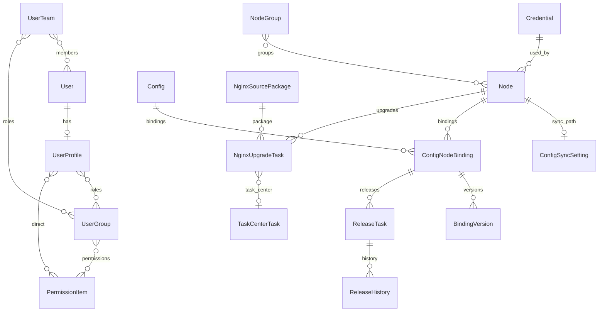

# 14 · 跨模块数据模型

## 1. 实体关系概览

## 2. 核心实体字段要点

### 2.1 节点 `Node`（`apps/nodes/models.py`）

| 字段 | 说明 |
|------|------|
| `hostname`, `ip`(unique), `port` | 连接身份 |
| `credential` FK | SSH 凭证，可空 |
| `groups` M2M | 节点组 |
| `environment` | dev/test/prod |
| `nginx_version`, `nginx_path` | 版本与二进制路径 |
| `nginx_available`, `last_nginx_probe_at` | Nginx 可用性（null/True/False）与探测时间；与 SSH `status` 独立（Q150） |
| `status` / `last_probe_at` | SSH 在线态与上次成功探测时间 |
| `status` | online/offline/unknown |
| `is_locked` | 锁定后限制部分操作 |
| `is_deleted` + `deleted_at/by` | 逻辑删除；默认 Manager 过滤已删 |
| `objects` / `all_objects` | 活跃 / 含已删 |

同 IP 再添加走恢复原主键（见 [06-nodes.md](06-nodes.md)）。

### 2.2 配置标签与绑定

| 实体 | 关键约束 |
|------|----------|
| `Config` | 标签元数据；`source`=manual/discovered |
| `ConfigNodeBinding` | `unique_together (config, node)`；内容与 `sync_status` 在此 |
| `BindingVersion` | `unique_together (binding, version)` |
| `ConfigSyncSetting` | 每节点 `main_conf_path` OneToOne |

绑定 `sync_status` 枚举见 [07-configs.md](07-configs.md)；其中 `conflict`/`syncing` 当前无写入路径（Q84/Q85）。

### 2.3 发布与任务中心

| 实体 | 说明 |
|------|------|
| `ReleaseTask` | 批次 + binding/config/node + publish_version + status |
| `ReleaseHistory` | publish/rollback 审计行 |
| `TaskCenterTask` | 全平台异步任务 |

批次号生成：`generate_batch_number()` → `release-YYMMDD-XXXX`（事务内 select_for_update）。

### 2.4 升级

| 实体 | 说明 |
|------|------|
| `NginxSourcePackage` | 版本唯一（按 uploaded_by）；MD5/大小 |
| `NginxUpgradeTask` | 多阶段 status；关联 `task_center`；批次 `UG-YYMMDD-XXXX` |

### 2.5 用户与权限

| 实体 | 说明 |
|------|------|
| `PermissionItem` | `code` 如 `nodes.read` |
| `UserGroup` | 角色 + M2M permissions |
| `UserTeam` | 成员 + 可选 roles |
| `UserProfile` | 扩展字段、角色、直授 |

### 2.6 凭证 / 审计 / 设置

| 实体 | 说明 |
|------|------|
| `Credential` | 密码/私钥 Fernet；`unique (name, created_by)` |
| `CredentialEnableTask` | 启用测试进度 + `task_center_id` |
| `AuditLog` | 含 `task_center_id`/`source_batch` |
| `LoginLog` | 含失败原因枚举 |
| `SystemSetting` | key-value；启动 seed |

## 3. 软删除与历史保留策略

- 节点逻辑删除后，默认查询不可见，但 `ReleaseTask`/`NginxUpgradeTask` 仍可通过 `all_objects` 或历史页展示，并标记「已删除」。
- 绑定：`not_synced`/`orphaned` 解除绑定时物理删除；已同步过的删除走 `marked_deleted`，下次同步远程清理（Q7）。

## 4. 哈希与漂移字段

- `ConfigNodeBinding.remote_content_hash`：发布成功时写入远程 MD5。
- `drift_detected_at`：预留；当前无检测任务写入（Q86）。
